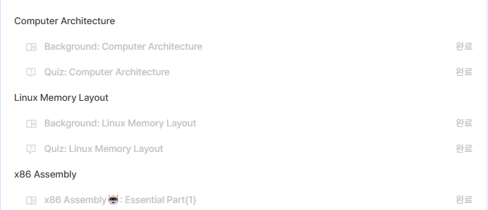

# week 1 Homework
## Author: LeeJaeHwan
## Date: 2025.04.05
## Content
- Computer Science
- Linux memory structure
- Assembly

---

# Q1: 드림핵 시스템 해킹 강의 **BackGround-Computer Science**의 **Computer Architecture**, **X86 Assembly: Essential part(1)** 학습 인증샷
> 인증샷에는 본인의 닉네임, 'Computer Architecture', 'X86 Assembly: Essential part(1)' 항목이 보여야 합니다. (Linux Memory Layout은 제외)



---

# Q2: RAX 레지스터의 값이 `0x1122334455667788` 일 때, 각 레지스터의 값 작성

## 🧠 RAX = `0x1122334455667788` 일 때, 각 레지스터 값

| 레지스터 | 크기        | 값               | 설명                                       |
|----------|-------------|------------------|--------------------------------------------|
| `RAX`    | 64비트      | `0x1122334455667788` | 전체 64비트 레지스터                          |
| `EAX`    | 하위 32비트 | `0x55667788`         | RAX의 하위 32비트                           |
| `AX`     | 하위 16비트 | `0x7788`             | RAX의 하위 16비트 (EAX의 하위 16비트)         |
| `AH`     | 상위 8비트  | `0x77`               | AX의 상위 바이트 (`0x77`)                    |
| `AL`     | 하위 8비트  | `0x88`               | AX의 하위 바이트 (`0x88`)                    |


---

# Q3: 아래의 코드에서 RIP 레지스터가 `sum` 함수의 `result = a + b + c;`를 가리킬 때 스택 상태 작성 (32비트 기준)

```c
#include <stdio.h>

int sum(int a, int b){
    int c = 1;
    int result = 0;
    result = a + b + c;
    return result;
}

int main(){
    int n = 10;
    int m = 20;
    sum(n, m);
    return 0;
}
```

## 📦 스택 구성 (RIP가 `result = a + b + c;`에 있을 때)

| 스택 상단(높은 주소) → 하단(낮은 주소) |
|--------------------------------------|
| `RET` ← main으로 돌아갈 주소            |
| `SFP` ← 이전 프레임 포인터 (EBP)        |
| `a = 10` ← 첫 번째 인자                  |
| `b = 20` ← 두 번째 인자                  |
| `c = 1` ← 지역 변수                     |
| `result = 31` ← 지역 변수               |

---

## 🧵 실행 흐름에 따른 스택 쌓임

```c
int main() {
    int n = 10;         // ① n 할당
    int m = 20;         // ② m 할당
    sum(n, m);          // ③ sum 호출 → 아래와 같이 스택 생성
    return 0;
}
```

### ✅ sum 함수 호출 시 스택 프레임

```
[높은 주소]
┌────────────────────────────┐
│ RET (main으로 돌아갈 주소)       │ ← sum 함수 끝나면 여기로 복귀
├────────────────────────────┤
│ SFP (main의 EBP)              │
├────────────────────────────┤
│ a = 10                       │ ← 인자 1
├────────────────────────────┤
│ b = 20                       │ ← 인자 2
├────────────────────────────┤
│ c = 1                        │ ← 지역 변수
├────────────────────────────┤
│ result = 31                 │ ← 지역 변수
└────────────────────────────┘
[낮은 주소]
```

---

