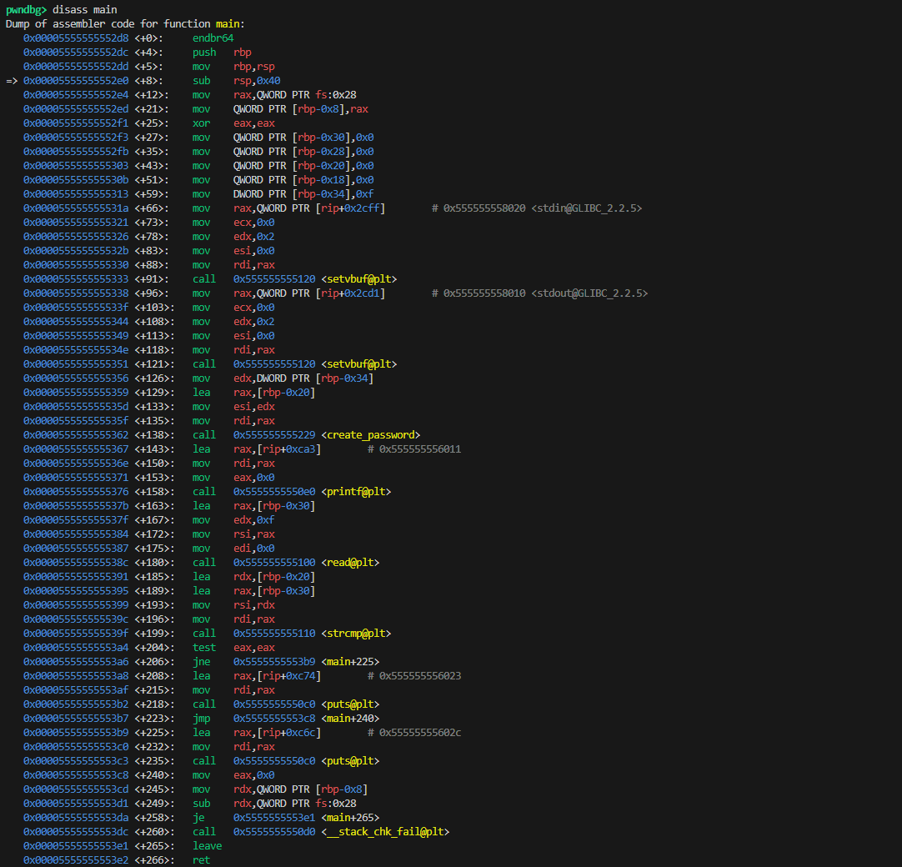
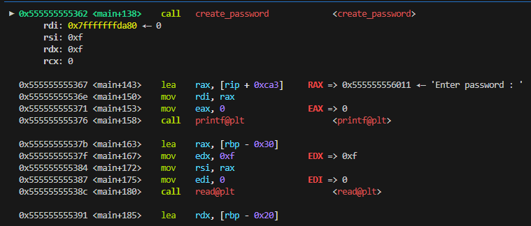
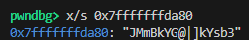
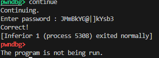
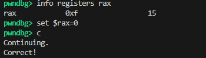

# GDB실습 

## [실습 C코드 - chall.c]
```c
#include <stdio.h>
#include <string.h>
#include <unistd.h>
#include <fcntl.h>
#include <sys/types.h>
#include <sys/stat.h>

void create_password(char *password, int len) {
    int fd = open("/dev/urandom", O_RDONLY);

    for (int i = 0; i < len; ) {
        char c;

        read(fd, &c, 1);
        if (0x20 < c && c < 0x7e)
            password[i++] = c;
    }
    close(fd);
}

int main() { 
    char buf[16] = { 0 }, password[16] = { 0 };
    int len = sizeof(password) - 1;

    // ignore this
    setvbuf(stdin, NULL, _IONBF, 0);
    setvbuf(stdout, NULL, _IONBF, 0);

    // create password with random bytes
    create_password(password, len);

    printf("Enter password : ");
    read(0, buf, sizeof(buf) - 1);

    if (!strcmp(buf, password))
        printf("Correct!\n");
    else
        printf("Wrong!\n");

    return 0;
}
```

## 목표
- 목표를 알려면 이 코드를 해석 해야한다.
- 간단히 해석해보자면
```
이 코드의 동작을 간단히 설명하면 다음과 같습니다.
main() 함수는 create_password() 함수를 호출하여 password[] 배열을 랜덤한 값으로 초기화합니다.
read() 함수를 호출하여 사용자의 입력을 받아 buf[] 배열에 저장합니다.
strcmp() 함수를 호출하여 buf[] 와 password[] 배열의 내용을 비교하고 같으면 “Correct!”, 다르면 “Wrong!”을 출력합니다.
```

>> 따라서 Correct! 가 출력되는게 목표이다.

## [문제풀이1] - 직접 패스워드 입력


- 비밀번호가 어디서 생성되는지 확인해보자.
```c
    create_password(password, len);
```

이 부분의 메모리 값 확인하는 법은 다음과 같다

### 1. disass로 main함수의 메모리 동작 확인
**[명령어]**
```shell
disass main
```

**[결과]**


[!] 주목해야할 점은 이 부분이다.

```gdb
   0x0000555555555362 <+138>:   call   0x555555555229 <create_password>
```

main함수 시작 레지스터 값에서 138을 더한 메모리에서 정확히 <create_password>를 ```call```해주고 있다.

### 2. 브레이크 포인트 걸기
앞에서 확인할 수 있듯이 메인함수 실행 메모리에서 138을 더한 값에서 break포인트를 걸어주면 패스워드가 생성되는 지점에서 프로그램 동작을 조정할 수 있다.

해당 브레이크 포인트 명령어는 다음과 같다
```gdb
break *(main+138)
```

### 3. 비밀번호 확인
이제 패스워드가 생성이 되었다.

이제 중요한 것은 **패스워드 확인**이다.

해당 ```create_password```가 실행되는 레지스터 값에 분명 패스워드가 저장되어있을 것이다.

gdb를 까보자



```DISASM(디스어셈블리영역)```에서 create_password가 call해진 레지스터값을 확인

해당 레스터에 있는 값을 메모리 조작을 해보자!

### 4. 메모리 조작

메모리 조작 방법은 다음과 같다

```shell
메모리 조작
- x/[n][size][format] [address] - address 주소부터 값 n 개를 특정 형식으로 출력합니다.
 - n - 1 이면 생략 가능
 - size - b (바이트), h (2바이트), w (4바이트), g (8바이트)
 - format - d (10진수), x/ (16진수),s (아스키 문자열), i (인스트럭션)
- telescope [address] - address 주소부터 메모리의 값들을 적당한 형식으로 출력합니다.
- set *[address]=[value] - address 주소에 값 value 를 대입합니다.

create_password() 함수가 모두 실행된 상태에서 앞서 복사한 password[] 배열 주소의 값을 확인하면 패스워드를 알아낼 수 있습니다. x 커맨드를 이용하여 메모리의 내용을 조사할 수 있습니다. 예를 들어 password[] 배열 주소의 문자열 하나를 출력하기 위해서는 x/s 커맨드를 사용합니다.
```

따라서 해당 레스터 값을 고려한
``` x/s 0x7fffffffda80 ``` 을 입력해주면 사진과 같다.



### 5. 정답출력

패스워드의 string값이 ```JMmBkYG@|]kYsb3``` 임을 확인할 수 있고

```continue```로 계속해주면



사진과 같이 Correct!가 출력됨을 알 수 있다.


## [문제풀이2] - 레지스터 값 조작해서 강제 Correct!출력

### [문제풀이1] 장단점

#### 장점
- 쉽다!
- 직관적이다!


#### 단점
- 하나하나 레지스터 값 확인해야함
- 실행 할 때마다 password[] 배열 값이 달라짐

> 일단 나는 쉽고 직관적인 풀이? 좋아한다
그리고 목표 자체가 ```Correct!```를 출력하는것이라면 굳이 password[] 배열을 확인할 필요가 없다.

### [!]그냥 strcmp에서 통과만 되면 끝

일단 strcmp 함수 호출 부분을 체크


위 사진에서 보면 ```0x00000000000013a4 <+204>:   test   eax,eax``` 이 부분이 buf 와 password 값을 비교하는 부분이다.

### rax값 설정

strcmp 함수의 리턴 값을 확인할 필요가 있는데, 해당 리턴값의 저장 순서는 다음과 같다.

```
📚 공식 규약 문서 내용 (요약)
인자(argument)들은 rdi, rsi, rdx, rcx, r8, r9 에 차례로 들어감

함수의 리턴값은 무조건 rax에 저장
```

따라서 strcmp 의 리턴 값인 rax를 '0'으로 set해주면 된다.



**[결과]**: 정상적으로 ```Correct!```가 출력되는 것을 확인할 수 있다.